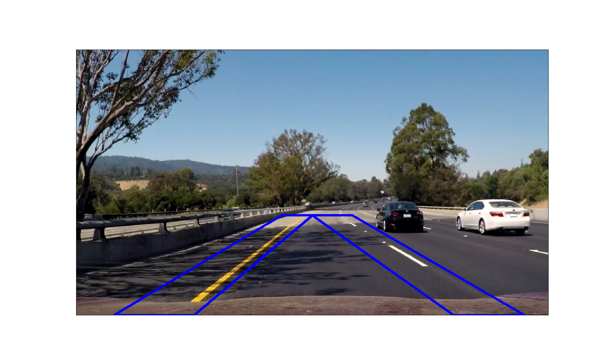
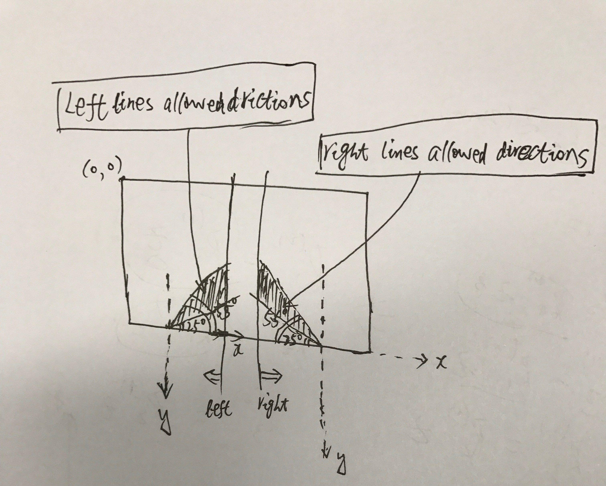
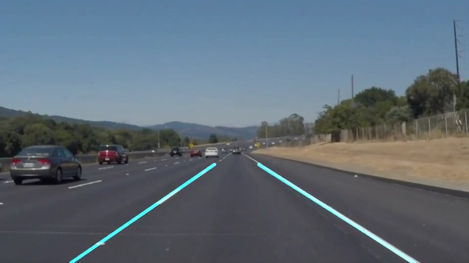

# **Finding Lane Lines on the Road** 

**Finding Lane Lines on the Road**

The goals / steps of this project are the following:
* Make a pipeline that finds lane lines on the road
* Reflect on your work in a written report


[//]: # (Image References)

[image1]: ./examples/grayscale.jpg "Grayscale"

---

### Reflection

### 1. Describe your pipeline. As part of the description, explain how you modified the draw_lines() function.

####My pipeline consisted of following steps:
(1) convert the image to grayscale, and then apply gaussian blur with kernel size 5 to the image:
```
# convert input image to grayscale
gray_img = grayscale(img)
# gaussian blur
kernel_size = 5
blurred_img = gaussian_blur(gray_img, kernel_size)
```
(2) call the helper function _`canny()`_ with `low_threshold = 10` and `high_threshold = 100`, to detect all the canny edges in the image:
```
# canny edge detection
low_threshold = 10
high_threshold = 100
edge_img = canny(blurred_img, low_threshold, high_threshold)
```
(3) define a polygon region and call the helper function _`region_of_interest()`_ to elimilate uninterested edges:
```
# define a polygon mask to filter out unrelated edges
polygons_vertices = \
       np.array([ \
             [(int(0.08*w), h), (int(0.435*w), int(0.625*h)), \
             (int(0.585*w), int(0.625*h)), (int(0.95*w), h), \
             (int(0.80*w), h), (int(0.5*w), int(0.625*h)), (int(0.25*w), h)]
                 ], dtype = np.int32)
mask_filterred_img = region_of_interest(edge_img, polygons_vertices)
```
the interested region looks like this:
{width=50%}
(4) call the helper function `hough_lines()` with following parameters, to detect line segments and get the result image with detected lines drawed:
```
rho = 2
theta = 1 * np.pi / 180
threshold = 4
min_line_length = 16
max_line_gap = 6
lines_img = hough_lines(mask_filterred_img, rho, theta, threshold, min_line_length, max_line_gap)
```

In order to draw a single line on the left and right lanes, I modified the draw_lines() function as following:
*(4.1)* calculate slope of each line segment,
*(4.2)* filter and separate line segments into left and right groups, i use slope and position of a line segement to do finish this job, demonstrated as following:
{width=60%}
*(4.3)* then for both the left and right line groups, average the slopes of each group as the result line sclope.
```
# average slopes of left line segments as the result slope for the left lane line[the 4-th element stores the slope of a line segment]
left_slope_avg = np.average(left_lines[:, 4])
# average slopes of left line segments as the result slope for the right lane line[the 4-th element stores the slope of a line segment]
right_slope_avg = np.average(right_lines[:, 4])
```
*(4.4)* and sort each group by line length, then select top-3 longest line segments, and avarage the vertices of these 3 line segments, use the averaged vertex as a point that the lane line pass through. from the line equation y = slope * x + b, it's easy to compute the bias `b`as `b = average_y - slope * average_x`. OK, now we get the equation of the left and right lane lines.

*(5)* we only need to define the y coordinate of the start and end point of a lane line, it's easy to caculate the x coordinate accordint to the line equation:
```
given y coordinate, x computed as:   x = (y - b)/slope
```
in the code, i defined y coordinate for the start and end point of a lane line as:
```
start_y = h
end_y = int(0.625 * h)
```

###the last result looks like:


### 2. Identify potential shortcomings with your current pipeline
(1) the result lane lines through the whole video seems not smooth enuogh;

(2) treat each frame as a single image, miss the information between consecutive frames.

(3) only low level image features are considered to solve the problem.


### 3. Suggest possible improvements to your pipeline
(1) use result from previous frames to smooth the result of current frame.

(2) use line track technology to utlize more information than only a single image.

(3) we may use machine learning or deep learning technologies to detect lane lines directly.
